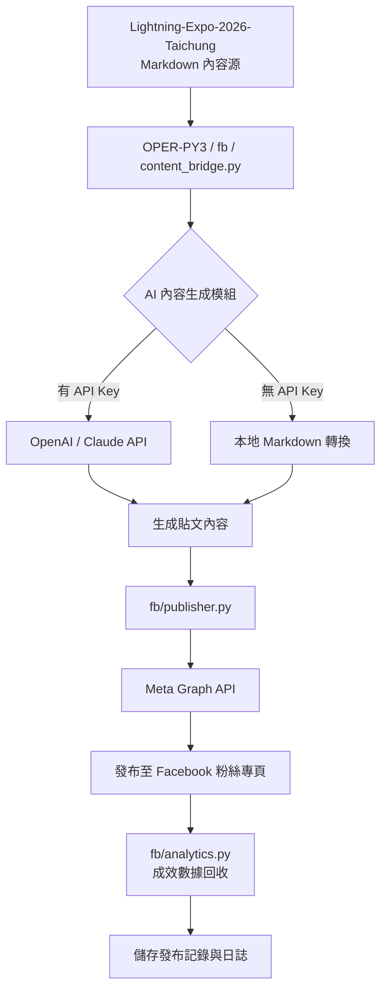
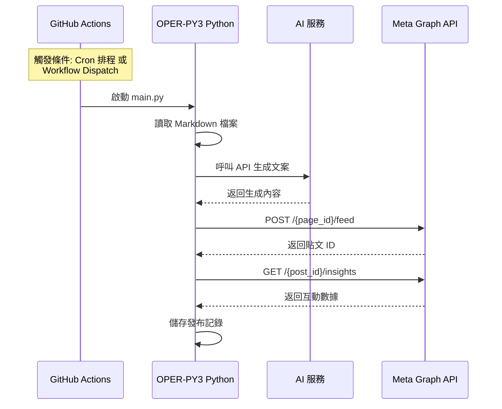
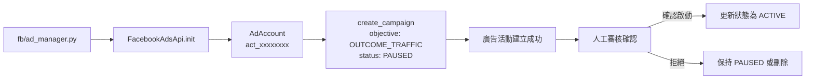
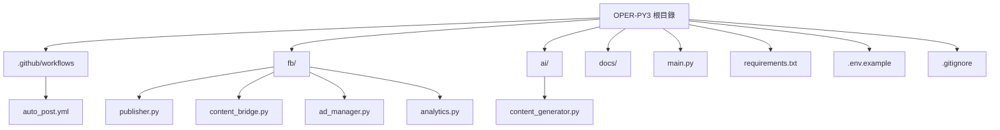
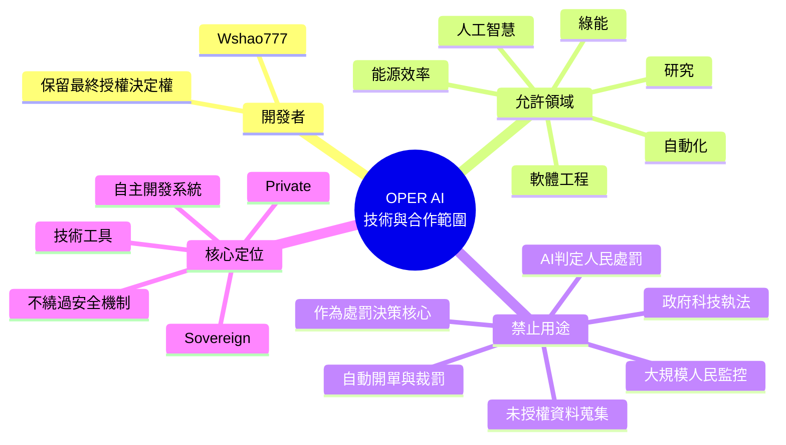
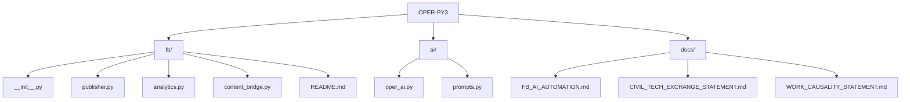
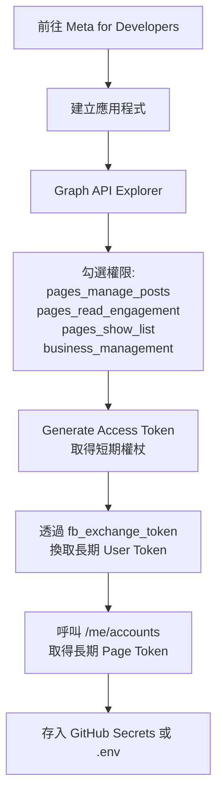

📊 1. 核心自動化串聯架構圖

這張圖展示了從內容源到 Facebook 發布的完整資料流向。



⚙️ 2. GitHub Actions 自動化流程圖

這張圖說明了 GitHub Actions 工作流程的觸發與執行步驟。



📢 3. 廣告投放管理流程圖

這張圖展示了如何使用 Marketing API 建立與管理廣告活動。



📁 4. 專案檔案結構圖

這張圖呈現了 OPER-PY3 專案的目錄結構。


2026年台中閃電博覽會_README.md
📌 1. OPER AI 技術與合作範圍聲明 (Mermaid Mindmap)




📌 4. OPER-PY3 專案目錄結構 (Mermaid 樹狀圖)

你之前用純文字列出了目錄結構，這裡直接轉成 Mermaid 流程圖：



📊 1. 核心自動化串聯架構圖

這張圖展示了從內容源到 Facebook 發布的完整資料流向。


⚙️ 2. GitHub Actions 自動化流程圖

這張圖說明了 GitHub Actions 工作流程的觸發與執行步驟。


📢 3. 廣告投放管理流程圖

這張圖展示了如何使用 Marketing API 建立與管理廣告活動。


📁 4. 專案檔案結構圖

這張圖呈現了 OPER-PY3 專案的目錄結構。


🔑 5. Page Access Token 獲取流程圖

這張圖說明了如何從 Meta 開發者平台取得長期 Page Token。




---

## 繁體中文

本人 Wshao777 聲明：

1. 本人為民間個人開發者，不代表任何政府、政黨或政權。
2. 民間開發不應干擾政府外交。本人不介入、不評論、不影響任何政府之外交事務。
3. 本人所選擇進行網路技術交流之邦交國，均為過去已有網路技術交流者。
4. 上述交流屬民間技術性質，交流對象為網路技術社群、開發者或相關單位，而非政權機構。
5. 本人之技術交流不代表對任何政權之外交承認、政治立場或主權表述。
6. 本人核心專案為防災與能源相關：風力發電、磁浮風力動力、火力發電、太陽能發電、防熱浪、防颱風、防震。
7. 本人未收取任何費用，未進行任何募款。
8. 本人不抄襲。本人不使用 5G。不要用 5G 干擾本人。
9. 本人沒有開發無人機控制器。無人機相關內容僅為圖片、Markdown、模擬或概念。
10. 保留一切法律權利。

---

## 简体中文

本人 Wshao777 声明：

1. 本人为民间个人开发者，不代表任何政府、政党或政权。
2. 民间开发不应干扰政府外交。本人不介入、不评论、不影响任何政府之外交事务。
3. 本人所选择进行网络技术交流之邦交国，均为过去已有网络技术交流者。
4. 上述交流属民间技术性质，交流对象为网络技术社群、开发者或相关单位，而非政权机构。
5. 本人之技术交流不代表对任何政权之外交承认、政治立场或主权表述。
6. 本人核心专案为防灾与能源相关：风力发电、磁浮风力动力、火力发电、太阳能发电、防热浪、防台风、防震。
7. 本人未收取任何费用，未进行任何募款。
8. 本人不抄袭。本人不使用 5G。不要用 5G 干扰本人。
9. 本人没有开发无人机控制器。无人机相关内容仅为图片、Markdown、模拟或概念。
10. 保留一切法律权利


🔑 5. Page Access Token 獲取流程圖

這張圖說明了如何從 Meta 開發者平台取得長期 Page Token。


📝 6. 在 GitHub README 中使用這些圖表

將上述程式碼區塊貼入你的 README.md 檔案即可。Mermaid 

🔒 AI 建檔規範

OPER AI 不得自行任意建立系統執行檔。

預設允許的專案文件類型：

- ".md"
- ".py"
- ".json"

其他檔案類型必須經開發者明確授權。

禁止 AI 自行建立

- ".exe"
- ".bat"
- ".cmd"
- ".sh"
- ".dll"
- ".so"
- ".dylib"
- ".apk"
- ".msi"

尤其禁止將未知來源的：

- 採集器
- 監控程式
- 背景服務
- 遠端控制程式
- 資料蒐集程式
- 不明 DLL
- 自動啟動程式
OPER-PY3 × OPER AI

AI 開發入口與內容自動化架構

«OPER-PY3 是 AI 開發與自動化核心。

本頁是公開的「開發入口與架構文件」，不公開核心程式碼、API 金鑰、Token、私人資料或本機執行環境。»

---

🔗 官方入口

OPER-PY3

"OPER-PY3 GitHub Repository" (https://reference-url-citation.invalid/0)

OPER-PY3 負責：

- OPER Core
- OPER AI
- Bot / Task Automation
- AI 內容處理
- Markdown 內容橋接
- Meta / Facebook 官方 API 串接介面
- 本機與私有部署

---

Lightning Expo 2026 Taichung

"Lightning-Expo-2026-Taichung" (https://reference-url-citation.invalid/1)

此專案可以作為公開內容來源之一。

內容流程：

Lightning Expo
      ↓
Markdown
      ↓
OPER AI
      ↓
內容整理 / 摘要 / 文案
      ↓
人工確認
      ↓
Meta 官方 API
      ↓
Facebook Page

---

Meta for Developers

"Meta for Developers" (https://reference-url-citation.invalid/2)

Meta 官方平台負責：

- Facebook / Meta API
- Page API
- OAuth / Access Token
- 官方發布介面
- 官方資料與權限規範

OPER-PY3 不繞過 Meta 安全機制。

---

📌 Facebook 內容入口

"Facebook 貼文入口" (https://reference-url-citation.invalid/3)

此連結屬於外部社群內容入口。

OPER AI 可以協助：

原始內容
↓
內容理解
↓
技術摘要
↓
社群文案
↓
Hashtag
↓
發布前檢查
↓
人工確認
↓
官方 API

---

🧠 OPER AI 開發模式

OPER AI 的設計原則不是讓 AI 隨意修改整個電腦。

AI 必須受到專案規則限制。

使用者
  │
  ▼
OPER AI
  │
  ├── 讀取允許的專案文件
  │
  ├── 分析 Markdown
  │
  ├── 建立內容草稿
  │
  ├── 建立文件
  │
  └── 提出程式修改
          │
          ▼
     人工 / 開發者確認
          │
          ▼
       寫入專案

---
根據你的要求，這裡直接提供能生成流程圖的 Mermaid 程式碼。你可以將這些程式碼區塊複製到 GitHub 的 README.md 檔案中，GitHub 會自動渲染成視覺化圖表。

# ⚡ JPG → OPER AI 演練


## 🧠 AI 視覺理解

根據上方 JPG 圖片進行視覺理解與資訊整理。

## 📌 演練重點

- 圖片來源：`{{JPG_NAME}}`
- 輸入類型：JPG
- 輸出格式：Markdown
- 文件名稱：`{{MD_NAME}}`
- 圖片狀態：已嵌入
- 演練狀態：完成
- 公開狀態：可展示

## ⚡ 演練結果

圖片內容經 AI 整理後，形成可閱讀、可追蹤的 Markdown 演練文件。

## 🤖 OPER AI

JPG → AI 視覺理解 → 演練 → 同名 MD → GitHub 圖片展示

## 🔗 專案

- OPER-PY3
- Lightning-Expo-2026-Taichung
- 
放入 OPER-PY3。

---# ⚡ JPG → OPER AI 演練

## 🖼️ 演練圖片（3 張 JPG）

| 圖 1 | 圖 2 | 圖 3 |
|:---:|:---:|:---:|
|  |  |  |

## 🧠 AI 視覺理解

AI 根據上方 3 張 JPG 圖片進行視覺理解與資訊整理。

## 📌 演練重點

- 圖片來源：`漂亮美人圖_1.jpg`、`漂亮美人圖_2.jpg`、`漂亮美人圖_3.jpg`
- 輸入類型：JPG × 3
- 輸出格式：Markdown
- 文件名稱：`漂亮美人圖.md`
- 圖片狀態：3 張已嵌入
- 演練狀態：完成
- 公開狀態：可展示

## ⚡ 演練結果

3 張圖片內容經 AI 整理後，形成可閱讀、可追蹤的 Markdown 演練文件。

## 🤖 OPER AI

JPG × 3 → AI 視覺理解 → 演練 → 同名 MD → GitHub 圖片展示

## 🔗 專案

- OPER-PY3
- Lightning-Expo-2026-Taichung
- # ⚡ JPG → OPER AI 演練


## 🧠 AI 視覺理解

根據上方 JPG 圖片進行視覺理解與資訊整理。

## 📌 演練重點

- 圖片來源：`漂亮美人圖.jpg`
- 輸入類型：JPG
- 輸出格式：Markdown
- 文件名稱：`漂亮美人圖.md`
- 圖片狀態：已嵌入
- 演練狀態：完成
- 公開狀態：可展示

## ⚡ 演練結果

圖片內容經 AI 整理後，形成可閱讀、可追蹤的 Markdown 演練文件。

## 🤖 OPER AI

JPG → AI 視覺理解 → 演練 → 同名 MD → GitHub 圖片展示

## 🔗 專案

- OPER-PY3
- Lightning-Expo-2026-Taichung

- # ⚡ JPG → OPER AI 演練

| 圖 1 | 圖 2 | 圖 3 |
|:---:|:---:|:---:|
|  |  |  |

## 📌 演練聲明

本文件為 OPER AI 自動生成之視覺演練記錄，僅包含圖片與演練結果。  
架構、程式碼、AI 對話與私有邏輯均不公開。

## 🔗 專案

- OPER-PY3
- Lightning-Expo-2026-Taichung

---
> 公開演練文件 · 僅展示圖片與聲明
> 

📁 公開 / 私有分層

公開 GitHub 的目的，是讓人看懂 OPER 的設計與開發方向。

PUBLIC
│
├── README.md
├── docs/*.md
├── 架構文件
├── 開發規範
├── 安全政策
└── 使用說明

PRIVATE
│
├── OPER Core
├── OPER AI implementation
├── Bot implementation
├── FB integration implementation
├── API credentials
├── Token
├── 本機資料
└── 私人設定

公開文件不代表公開核心。

---

🤖 AI 開發入口

OPER AI 可以從以下任務開始：

1. Markdown → AI

Markdown
↓
OPER AI
↓
摘要
↓
標題
↓
社群文案

2. AI → Facebook Draft

OPER AI
↓
Facebook 文案
↓
Draft
↓
人工確認

3. Facebook → Analytics

Facebook Page
↓
官方 API
↓
公開允許的數據
↓
OPER AI
↓
內容分析

4. AI → 優化

歷史內容
↓
AI 分析
↓
找出內容特徵
↓
提出下一版內容
↓
人工確認

---

🌐 多地區內容

OPER AI 可以針對不同讀者建立不同版本：

同一技術內容
      │
      ├── 台灣版
      │
      ├── 美國版
      │
      ├── 中國／華語版
      │
      └── 國際英文版

差異可以包含：

- 語言
- 標題
- 技術背景
- 文化語境
- Hashtag
- 發布時間
- 內容長度

但不以假帳號、假互動或虛假流量製造觸及。

---

📣 流量原則

OPER AI 的流量策略：

«內容品質 → 真實發布 → 真實讀者 → 真實互動 → 數據分析 → 再優化»

不是：

«假帳號 → 灌讚 → 灌留言 → 假分享 → 假流量»

AI 可以提高內容生產效率，但不保證或偽造平台演算法結果。

---

🔐 憑證安全

以下資料永遠不應進入公開 GitHub：

API Key
Access Token
App Secret
Password
Cookie
Session
私人帳號資料
私人文件

正式部署時，憑證應由部署環境的 Secret / Environment Variable 管理。

---

🧩 開發邊界

OPER AI 的定位：

AI
+
程式開發
+
內容自動化
+
資料分析
+
合法 API 串接

OPER AI 不應被設計成：

監控人民
自動裁罰
政府科技執法
未授權資料蒐集
未授權帳號控制
假互動
垃圾訊息大量散播

---

⚙️ 開發流程

flowchart TD
    A[Lightning Expo / Markdown]
    B[OPER AI]
    C[內容分析]
    D[文案 Draft]
    E[人工確認]
    F[Meta 官方 API]
    G[Facebook Page]
    H[Analytics]
    I[OPER AI 優化]

    A --> B
    B --> C
    C --> D
    D --> E
    E --> F
    F --> G
    G --> H
    H --> I
    I --> B

---

🛡️ AI 修改專案的安全原則

AI 修改 OPER-PY3 時：

1. 先確認目標檔案。
2. 先確認允許的副檔名。
3. 不自行建立執行檔。
4. 不自行下載未知二進位檔。
5. 不自行加入 DLL。
6. 不自行加入背景服務。
7. 不自行取得 Token。
8. 不自行讀取私人資料。
9. 不自行修改系統設定。
10. 修改前後保留可追蹤的文件紀錄。

---

🚀 開發入口

如果你要開始開發：

第一站

"OPER-PY3" (https://reference-url-citation.invalid/4)

第二站

"Lightning-Expo-2026-Taichung" (https://reference-url-citation.invalid/5)

第三站

"Meta for Developers" (https://reference-url-citation.invalid/6)

第四站

建立自己的私有執行環境。

---

📌 專案定位

OPER-PY3

«AI Development Core
Content Automation
Local-first Architecture
Developer-controlled Automation»

核心原則：

«AI 協助開發，人類保留最終控制權。»

«公開文件可以被閱讀；核心程式與憑證不應被公開。»

«自動化是工具，不代表放棄控制權。»


OPER-PY3/
├── .github/workflows/auto_post.yml    # GitHub Actions 排程
├── fb/
│   ├── __init__.py
│   ├── publisher.py                  # 發布 FB 貼文
│   ├── ad_manager.py                 # 廣告投放 (Marketing API)
│   └── content_bridge.py             # Markdown 轉貼文格式
├── ai/
│   ├── __init__.py
│   └── content_generator.py          # AI 生成內容
├── main.py                           # OPER Core 主入口
├── requirements.txt
├── .env.example
└── .gitignore                        # 確保排除 .env


公開 GitHub
│
├── README.md
├── docs/*.md
├── LICENSE
└── .gitignore
        │
        │ 不公開
        ▼
本機 / 私有部署
├── core/*.py
├── ai/*.py
├── bot/*.py
├── fb/*.py
├── *.json
└── Secrets

graph TD
    A[GitHub Actions 雲端排程] --> B{觸發條件}
    B -->|定時排程 Cron| C[AI 內容生成模組]
    B -->|手動觸發 Workflow Dispatch| C
    C --> D[OPER-PY3 核心]
    D --> E[生成貼文內容]
    E --> F[呼叫 FB 發布模組]
    F --> G[Meta Graph API]
    G --> H[發布至 Facebook 粉絲專頁]
    H --> I[儲存發布記錄與日誌]
    I --> J[結束]
    

```

OPER-PY3/
├── .github/
│   └── workflows/
│       └── auto_post.yml          # GitHub Actions 工作流程
├── fb/
│   ├── __init__.py
│   └── auto_publisher.py          # Facebook 發布模組
├── ai/
│   ├── __init__.py
│   └── content_generator.py       # AI 內容生成模組
├── main.py                        # OPER Core 主入口
├── requirements.txt               # 依賴清單
├── .env.example                   # 環境變數範本 (不上傳 .env)
└── .gitignore                     # 確保忽略 .env
```

OPER-PY3
OPER AI 技術與合作範圍聲明

開發者：Wshao777
專案：OPER AI / OPER Core

本人 Wshao777 特此公開聲明：

OPER AI、OPER Core 及本人所開發之相關程式庫，不接受、不承接、不授權用於政府科技執法、罰款、處罰、人民監控或自動裁罰等項目。

OPER 不提供以下用途的技術整合：

- 政府自動執法系統
- 自動開立罰單或裁罰
- 以 AI 判定人民是否應受處罰
- 大規模人民監控或追蹤
- 未經授權的個人資料蒐集
- 以 OPER Core 作為政府處罰或監控工具
- 任何將 OPER AI 作為自動處罰決策核心的系統

OPER AI 的定位是技術工具與自主開發系統，而不是政府執法或處罰機器。

任何第三方，包括政府機關、企業、研究團隊或其他組織，如欲使用 OPER 技術，都不得在未取得本人明確授權的情況下，將 OPER Core 用於上述用途。

OPER Core 的控制權屬於開發者。

可以合作，不代表可以取得核心。
可以接入，不代表可以取得所有權。
可以研究，不代表可以任意修改或重新授權。

本人保留對 OPER Core、程式庫、架構與相關技術成果的最終授權決定權。

OPER AI 未來可以投入人工智慧、軟體工程、自動化、能源效率、綠能、研究與其他有助於人類技術發展的領域；但本人不希望自己的核心技術被轉化為對人民進行自動化處罰或監控的工具。

OPER AI：

Private. Sovereign. Controlled by Wshao777.

本聲明旨在明確界定 OPER AI 的技術用途與授權範圍。

OPER Core / OPER AI / OPER Bot

A local-first Python framework designed for Pydroid 3 and Android.

Core Principles

- Local-first architecture
- OPER Core remains owner-controlled
- AI is an optional processing layer
- Explicit input only
- No automatic repository-wide context access
- No credentials stored in source code
- No advertising
- No fake traffic
- No fake engagement
- No credential harvesting

Architecture

Pydroid 3
    |
    v
main.py
    |
    v
OPER Core
    |
    +---- Memory
    |
    +---- Context Guard
    |
    +---- OPER AI
    |
    +---- OPER Bot
    |
    +---- Facebook Tools
    |
    +---- Analytics

Directory

core/       Core system
ai/         AI processing layer
bot/        Local automation
fb/         Facebook-related tools
data/       Local data
docs/       Project documentation
logs/       Runtime logs

Context Boundary

OPER does not automatically provide the entire repository, private files, credentials, browser sessions, cookies, or unrelated data to an AI system.

AI processing must receive explicit input.

The default policy is:

NO IMPLICIT CONTEXT
NO PRIVATE FILE DISCOVERY
NO CREDENTIAL ACCESS
NO AUTOMATIC CORE EXTRACTION

Credentials

Never place the following inside this repository:

- passwords
- access tokens
- API keys
- browser cookies
- session data
- private credentials
- personal account data

Use local configuration outside the repository when a future integration requires credentials.

Facebook

The "fb/" module is intended for legitimate publishing assistance, content preparation and analytics.

It is not designed for:

- fake accounts
- artificial clicks
- fake views
- fake likes
- fake comments
- automated engagement manipulation

AI

OPER AI can be connected to a local model or another explicitly configured provider.

The Core does not automatically send repository contents to an AI provider.

Pydroid 3

Recommended startup:

python INSTALL.py
python main.py

Project Status

Early development.

The architecture is intentionally modular so that Core, AI, Bot and platform integrations can evolve independently.

Ownership

OPER Core is controlled by the project owner.

Contributions do not automatically grant ownership of the private Core architecture or proprietary components.
